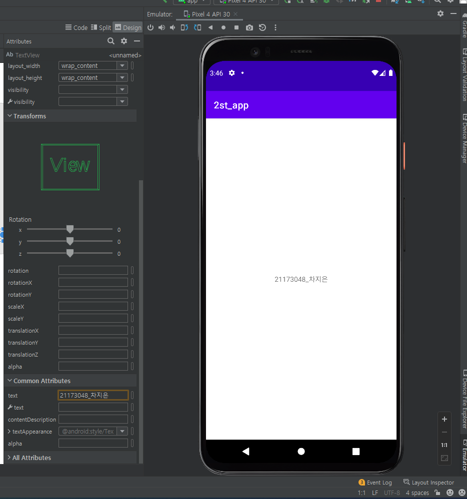
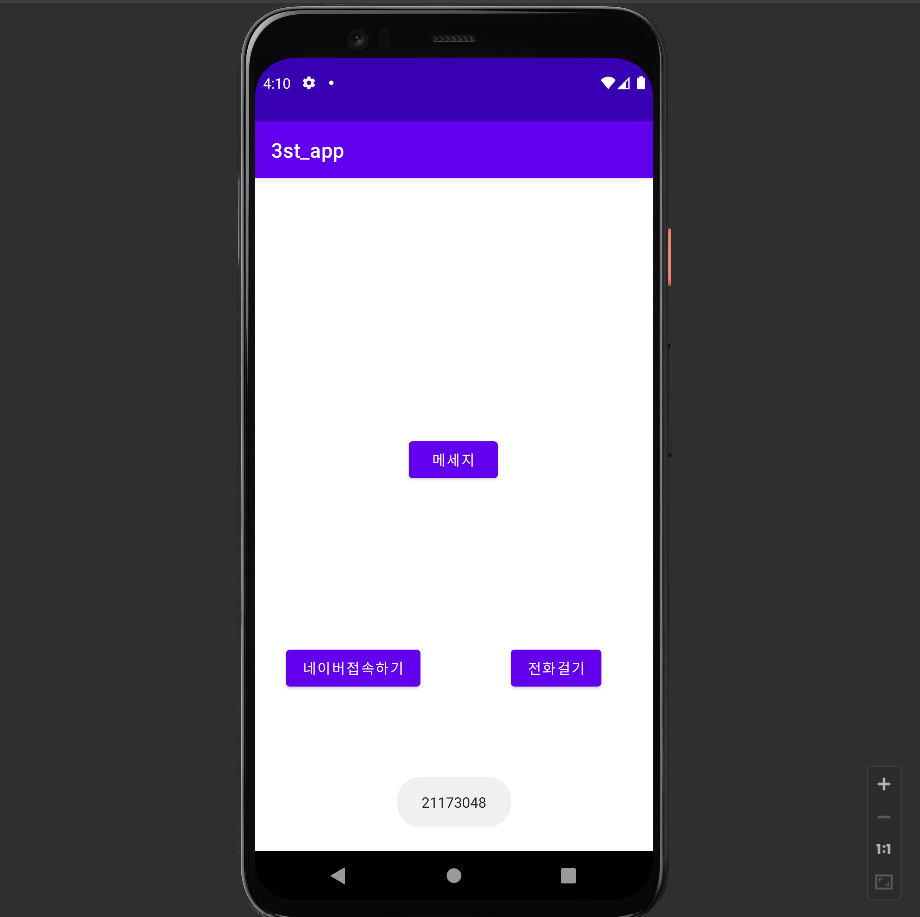
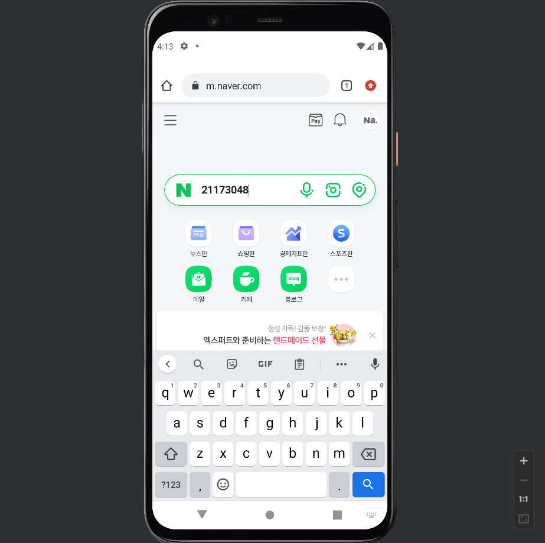
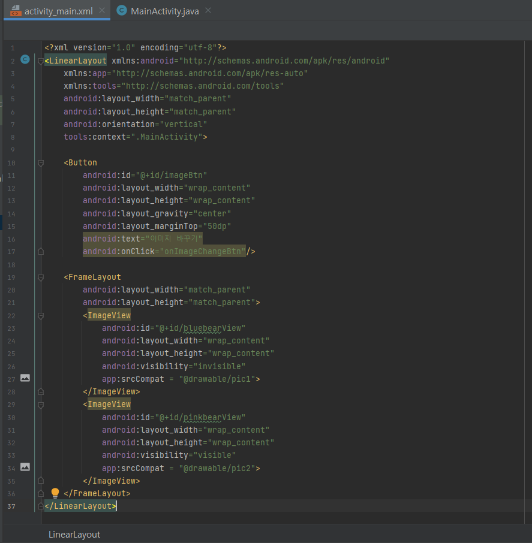
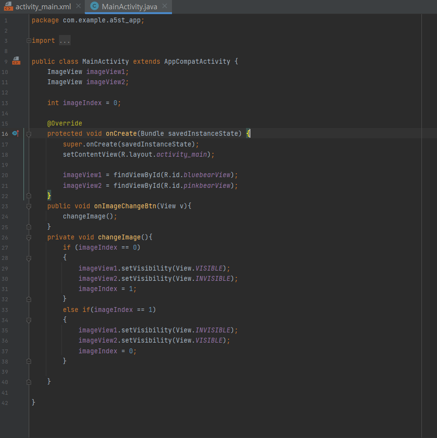
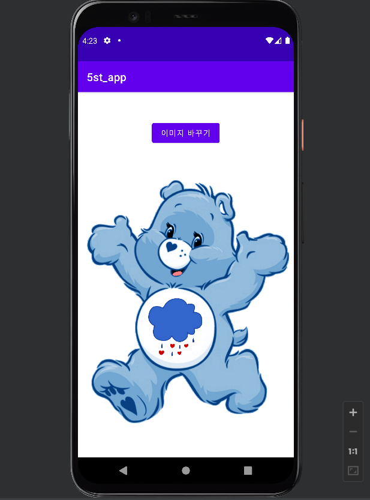

# 2주차 (2022-03-15)
  - 안드로이드 스튜디오 설치 & 깃허브 저장소 생성

</img>

# 3주차 (2022-03-22)
  - 토스트 메세지 & 네이버 접속하기 & 전화 걸기

</img>
</img>
</img>

# 5주차 (2022-04-05)
- 프레임 레이아웃과 뷰의 전환

</img>
</img>
</img>
</img>

