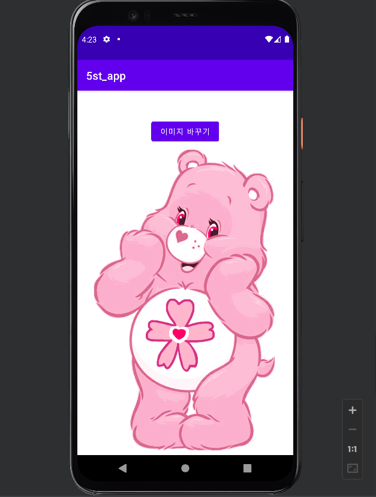

# 2주차 (2022-03-15)
  - 안드로이드 스튜디오 설치 & 깃허브 저장소 생성

</img>

# 3주차 (2022-03-22)
  - 토스트 메세지 & 네이버 접속하기 & 전화 걸기

</img>
</img>
</img>

# 5주차 (2022-04-05)
- 프레임 레이아웃과 뷰의 전환

</img>
</img>
</img>
</img>

# 6주차 (2022-04-12)

- 한 개의 버튼을 클릭하면 
1. Toast.makeText() 이용 하단에 width 크기 값을 표시 (Interger.toString() 함수 사용) 

- 또 다른 버튼을 클릭하면 
2. Toast.makeText() 하단에 height 크기 값을 표시 (Interger.toString() 함수 사용)

</img>
</img>

# 10주차 (2022-05-10)

- 여러 화면 만들고 화면 간 전환하기
</img>
</img>
</img>

# 11주차 (2022-05-17)

- 웹으로 요청하기
</img>
